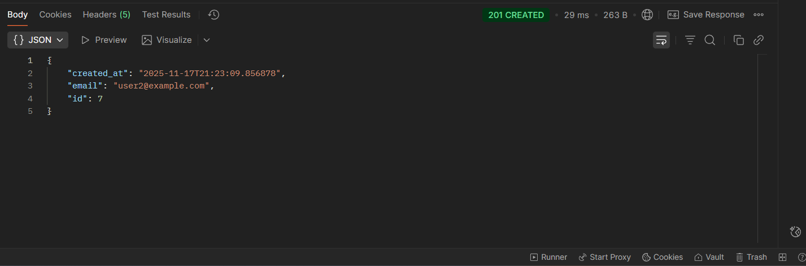
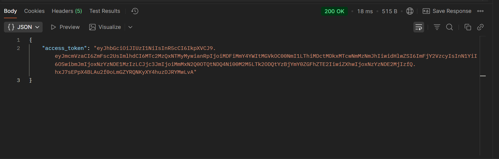

# Лабораторна робота 3 — Валідація, обробка помилок, ORM


**Проєкт:** Expenses API (Flask + SQLAlchemy)  
**Група:** 32 → `32 % 3 = 2` ⇒ **Варіант: користувацькі категорії витрат**

---

## Мета та завдання ЛР3

Мета роботи – покращити проєкт обліку витрат за рахунок:

- валідації вхідних даних;
- централізованої обробки помилок;
- використання ORM-моделей і міграцій бази даних;
- реалізації **користувацьких категорій витрат** (глобальні + персональні).

Основне:

- є **глобальні категорії** (видимі для всіх користувачів);
- є **користувацькі категорії**, прив’язані до конкретного `user_id`;
- фільтрація витрат за користувачем і категоріями;
- коректні коди відповіді (400, 404, 409 тощо).

---

## Стек

- **Flask**, **flask-smorest** — REST API, валідація, OpenAPI
- **SQLAlchemy**, **Flask-Migrate** — ORM + міграції
- **PostgreSQL** — база даних (docker-compose)
- **Marshmallow** — схеми запитів/відповідей, валідація
- **Docker / docker-compose** — запуск БД та API в контейнерах

---

## Запуск через Docker

1. Переконатися, що встановлені **Docker Desktop** та **docker-compose**.
2. У корені проєкту (`Lab 3`) виконати:

```bash
docker compose up --build
```

3. Після старту контейнерів API буде доступний на:

```text
http://localhost:5000
```

Перевірка healthcheck:

```text
GET http://localhost:5000/health
```

---

## Скріншоти ЛР3

### 1. Docker Desktop — запущені контейнери


### 2. Тести для users та categories


### 3. Тести для expenses


### 4. Список витрат (endpoint /api/expenses)


---

## Postman (ЛР3)

Колекція та environment у каталозі `postman/`:

- `expenses_lab3_collection.json`
- `expenses_lab3_environment.json`

У середовищі **Expenses API — local**:

- змінна `baseUrl` = `http://localhost:5000`;
- для користувацьких категорій у запитах додається заголовок `X-User-Id`.

---

# Лабораторна робота 4 — Аутентифікація (JWT)

У ЛР4 до проєкту ЛР3 додано **аутентифікацію на основі JWT**:

- реєстрація користувачів із хешуванням пароля (`passlib.pbkdf2_sha256`);
- логін і видача **JWT access_token** (`flask-jwt-extended`);
- захист більшості ендпоінтів через `@jwt_required()`:
  - `GET /api/users`
  - `POST /api/categories`, `GET /api/categories`
  - `POST /api/expenses`, `GET /api/expenses` тощо;
- обробники типових помилок JWT (прострочений токен, невалідний токен, відсутній токен);
- оновлена Postman-колекція з flow: **Register → Login → інші запити з токеном**.

---

## Конфігурація JWT

Секретний ключ для підпису токенів читається з змінної середовища:

```text
JWT_SECRET_KEY
```

Приклад (PowerShell, Windows):

```powershell
$Env:JWT_SECRET_KEY = "180986620027478057812366299827004465232"
$Env:FLASK_APP = "manage.py"
```

Після цього API можна запускати локально або в Docker.

---

## Запуск локально (без Docker, опціонально)

1. Створити та активувати віртуальне середовище:

```powershell
python -m venv .venv
.\.venv\Scripts\Activate.ps1
```

2. Встановити залежності:

```powershell
pip install -r requirements.txt
```

3. Задати змінні середовища (як вище) і запустити:

```powershell
python -m flask run
```

---

## Postman (ЛР4, JWT flow)

1. Імпорт з каталогу `postman/`:
   - `expenses_lab3_collection.json` (оновлена колекція для ЛР4),
   - `expenses_lab3_environment.json`.

2. Вибрати environment **Expenses API — local** (`baseUrl = http://localhost:5000`).

3. Виконати запити послідовно:

1) **Auth / Register**

```http
POST {{baseUrl}}/api/users
```

Body (JSON):

```json
{
  "email": "user3@example.com",
  "password": "secret123"
}
```

Успішна відповідь: `201 Created` + дані користувача.

2) **Auth / Login**

```http
POST {{baseUrl}}/api/users/login
```

Body (JSON):

```json
{
  "email": "user3@example.com",
  "password": "secret123"
}
```

У Tests колекції зберігається `access_token` у змінну `accessToken` середовища.  
Далі всі захищені ендпоінти використовують заголовок:

```http
Authorization: Bearer {{accessToken}}
```

3) Інші запити колекції (**Users / List**, **Categories / ...**, **Expenses / ...**) уже автоматично додають цей заголовок.

---

## Скріншоти ЛР4 (JWT)

### 1. Реєстрація користувача



### 2. Логін та отримання JWT-токена



---

Таким чином, у репозиторії реалізовано:

- ЛР3 — валідація, обробка помилок, ORM, користувацькі категорії витрат;
- ЛР4 — JWT-аутентифікація, захист ендпоінтів, flow у Postman та демонстраційні скріншоти.
