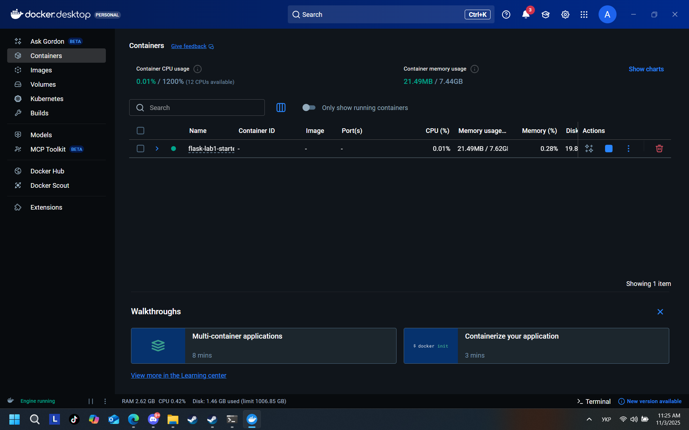
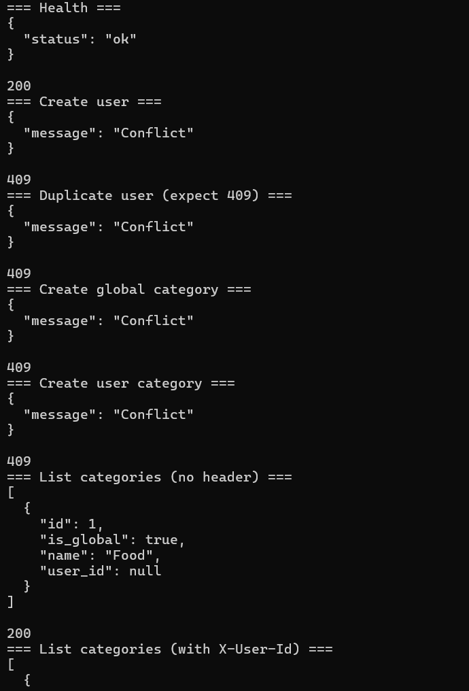
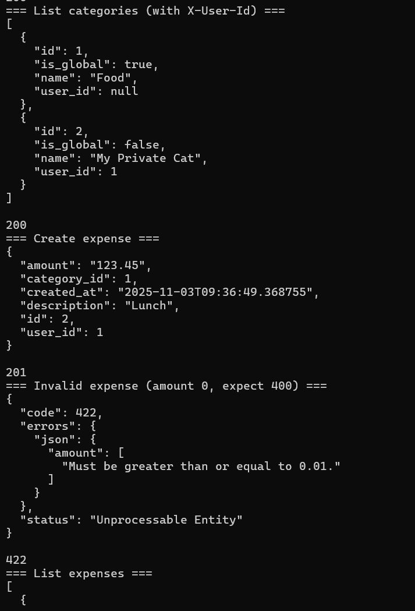
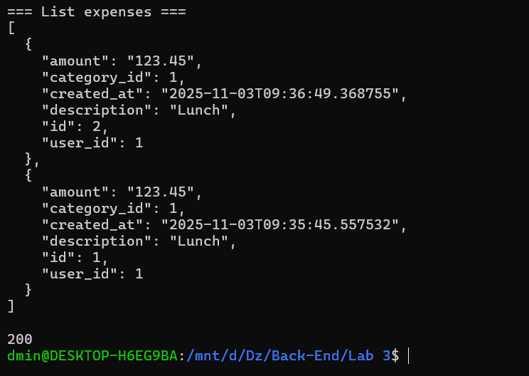

# Лабораторна робота №3
## Тема: Розробка REST API з Flask та Docker

**Виконав:** Бурлій Андрій  
**Група:** ІО-32  
**Варіант:** 3

---

## Мета роботи
Розробити REST API для обліку витрат із використанням Flask, SQLAlchemy, PostgreSQL та Docker Compose. Реалізувати CRUD для користувачів, категорій і витрат; забезпечити контейнеризований запуск і перевірку через Postman/curl.

---

## Використані технології
- Python 3.11  
- Flask 3.x  
- SQLAlchemy + Alembic (Flask-Migrate)  
- PostgreSQL 16  
- Docker Compose  
- Marshmallow (валідація)  
- Postman / curl

---

## Етапи виконання

### 1. Запуск середовища
Файл `docker-compose.yml` піднімає:
- **db** — PostgreSQL 16  
- **api** — Flask-додаток

Запуск:
```bash
docker-compose up --build
```

Після запуску обидва контейнери працюють коректно.

**Рис. 1. Запущені контейнери у Docker Desktop**  


---

### 2. Міграції бази даних
Ініціалізація та створення таблиць:
```bash
flask --app manage.py db init
flask --app manage.py db migrate -m "initial"
flask --app manage.py db upgrade
```
Створено таблиці: `users`, `categories`, `expenses`.

---

### 3. Перевірка ендпоінтів користувачів і категорій
Запити:
- `GET /health` — 200 OK  
- `POST /api/users` — 201 Created (або 409 Conflict)  
- `POST /api/categories` — 201 Created (або 409 Conflict)  
- `GET /api/categories` — 200 OK

**Рис. 2. Тестування ендпоінтів користувачів та категорій**  


---

### 4. Робота з витратами
- `POST /api/expenses` — 201 Created  
- Невалідні дані (сума = 0) — 422 Unprocessable Entity  
- `GET /api/expenses` — 200 OK

**Рис. 3. Створення витрати та помилка валідації**  


**Рис. 4. Відповідь `GET /api/expenses`**  


---

## Postman колекція
У репозиторії є колекція для перевірки:
- **`Lab3_Burlii_IO32_V3.postman_collection.json`**

Запити в колекції:
1. `GET /health`  
2. `POST /api/users`  
3. `POST /api/categories`  
4. `POST /api/expenses`  
5. `GET /api/expenses`

---

## Структура проєкту
```
Lab3/
 ├─ app/
 │  ├─ __init__.py
 │  ├─ models.py
 │  ├─ schemas.py
 │  └─ routes/
 │     ├─ users.py
 │     ├─ categories.py
 │     └─ expenses.py
 ├─ migrations/
 ├─ postman/
 ├─ screens/
 │  ├─ 01_docker_desktop_containers.png
 │  ├─ 02_api_users_categories_tests.png
 │  ├─ 03_api_expenses_tests.png
 │  └─ 04_api_expenses_list.png
 ├─ Dockerfile
 ├─ docker-compose.yml
 ├─ manage.py
 ├─ config.py
 ├─ requirements.txt
 ├─ wsgi.py
 └─ README.md
```

---

## Висновок
Створено REST API для обліку витрат, реалізовано моделі та CRUD-операції (SQLAlchemy), налаштовано Docker Compose (API + PostgreSQL), виконано міграції та перевірено ендпоінти через curl і Postman. Звіт оформлено зі скріншотами та колекцією.

---

**GitHub:** [https://github.com/AndriiBurlii/lab3-backend-burlii](https://github.com/AndriiBurlii/lab3-backend-burlii)
